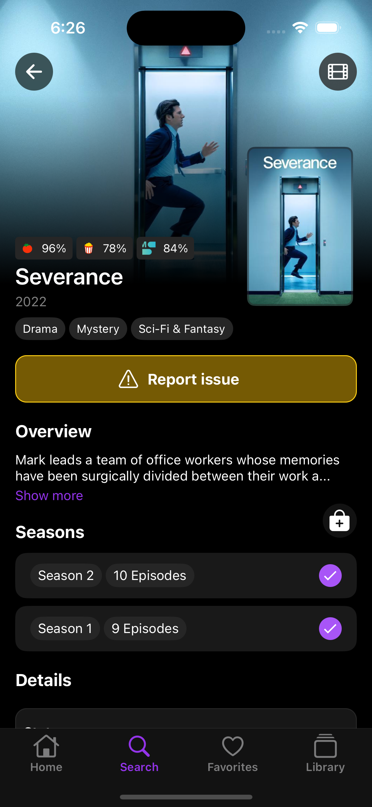
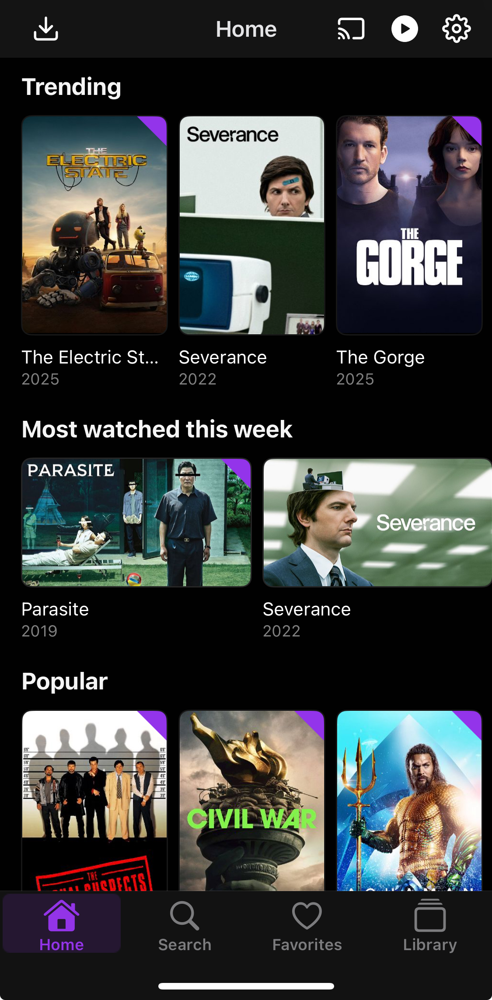

<h1>Companion plugin for Streamyfin</h1>

  <b>Allows for a centralised configuration of the Streamyfin application.</b>
   
  Configure and synchronize the apps settings or notifications!

Features
------

With this plugin you allow the streamyfin application to do the following... 

<table>
  <thead>
    <th>Automatically log in users into <a href="https://github.com/fallenbagel/jellyseerr">jellyseerr</a></th>
    <th>Custom Home screen using <a href="https://github.com/lostb1t/jellyfin-plugin-collection-import">collections</a></th>
    <th><a href="./NOTIFICATIONS.md">Notification</a> support</th>
  </thead>
  <tbody>
    <tr>
      <td valign="top"></td>
      <td valign="top"></td>
      <td valign="top"></td>
    </tr>
  </tbody>
</table>

<h3 align="center">Plus many more features!</h3>

Install Process
------

1. In jellyfin, go to dashboard -> plugins -> repositories -> copy and paste this link: https://raw.githubusercontent.com/streamyfin/jellyfin-plugin-streamyfin/main/manifest.json
2. Go to Catalog and search for Streamyfin
3. Click on it and install
4. Restart Jellyfin

More information
------

### Automatically log into jellyseerr

We currently offer the ability to log in your users into jellyseerr for a seamless jellyseerr integration. 
Currently this is only supported if you use Jellyfin authentication to log into your jellyseerr instance.

### Customize home screen

You are able to further customize your home screen beyond jellyfins current limits.
This can be done alongside using the [collection import](https://github.com/lostb1t/jellyfin-plugin-collection-import) plugin, one can make very dynamic homescreens.

Be inspired to create home screens by adding views for collections like 
`Trending`, `Popular`, `Most viewed`, etc.  
Just like you would see from major streaming applications like netflix!

### Notifications

We're currently working hard to offer some of jellyfins events as notifications when you use streamyfin. 
Some notifications that work out the box with almost no configuration are:

- `Item Added` tells you when new content is added to your server. This also summarizes the total episodes being added for a series season. This reduces the amount of notification spam.
- `Session Started` allows you to see when your users are online in jellyfin
- `Playback started` allows you to see when content is being played from your server
- `User locked out` allows you to see when a user has been locked out from their account so you can be proactive on resetting if required.

And if thats not enough we also offer a notification end point that you can use to utilize with any other service!

[Read more about notifications](NOTIFICATIONS.md)

### Using the plugin configuration page

We offer the ability to modify the configuration via yaml or by normal form.

See [yaml examples](https://github.com/streamyfin/jellyfin-plugin-streamyfin/tree/main/examples)